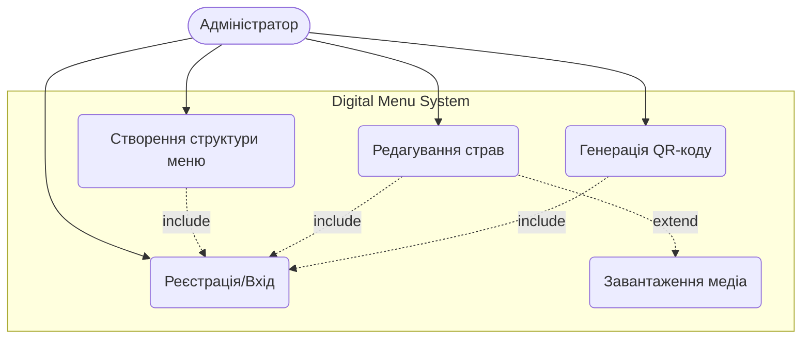
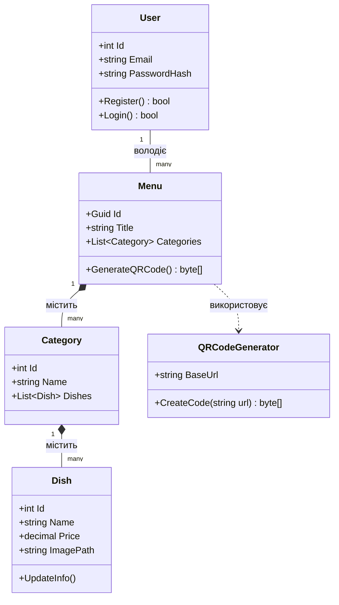
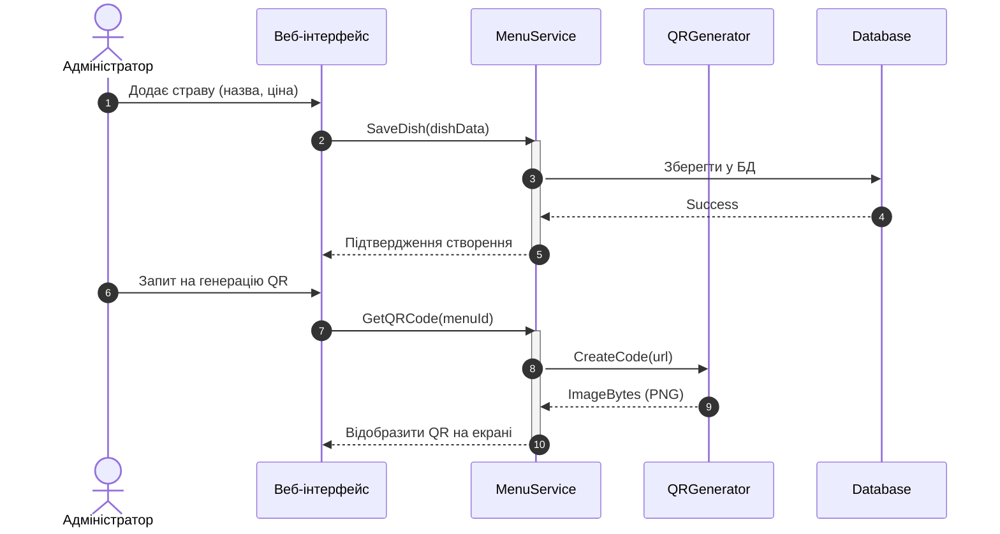

```mermaid


flowchart TB
    Admin([Адміністратор])

    subgraph "Digital Menu System"
        UC_Auth(Реєстрація/Вхід)
        UC_Cat(Створення структури меню)
        UC_Dish(Редагування страв)
        UC_Photo(Завантаження медіа)
        UC_QR(Генерація QR-коду)
    end

    Admin --> UC_Auth
    Admin --> UC_Cat
    Admin --> UC_Dish
    Admin --> UC_QR

    UC_Dish -.->|extend| UC_Photo
    UC_Cat -.->|include| UC_Auth
    UC_Dish -.->|include| UC_Auth
    UC_QR -.->|include| UC_Auth


```

```mermaid
classDiagram
    class User {
        +int Id
        +string Email
        +string PasswordHash
        +Register() bool
        +Login() bool
    }
    class Menu {
        +Guid Id
        +string Title
        +List~Category~ Categories
        +GenerateQRCode() byte[]
    }
    class Category {
        +int Id
        +string Name
        +List~Dish~ Dishes
    }
    class Dish {
        +int Id
        +string Name
        +decimal Price
        +string ImagePath
        +UpdateInfo()
    }
    class QRCodeGenerator {
        +string BaseUrl
        +CreateCode(string url) byte[]
    }

    User "1" -- "many" Menu : володіє
    Menu "1" *-- "many" Category : містить
    Category "1" *-- "many" Dish : містить
    Menu ..> QRCodeGenerator : використовує

```

```mermaid
sequenceDiagram
    autonumber
    actor Admin as Адміністратор
    participant UI as Веб-інтерфейс
    participant API as MenuService
    participant QR as QRGenerator
    participant DB as Database

    Admin->>UI: Додає страву (назва, ціна)
    UI->>API: SaveDish(dishData)
    activate API
    API->>DB: Зберегти у БД
    DB-->>API: Success
    API-->>UI: Підтвердження створення
    deactivate API

    Admin->>UI: Запит на генерацію QR
    UI->>API: GetQRCode(menuId)
    activate API
    API->>QR: CreateCode(url)
    QR-->>API: ImageBytes (PNG)
    API-->>UI: Відобразити QR на екрані
    deactivate API

```
